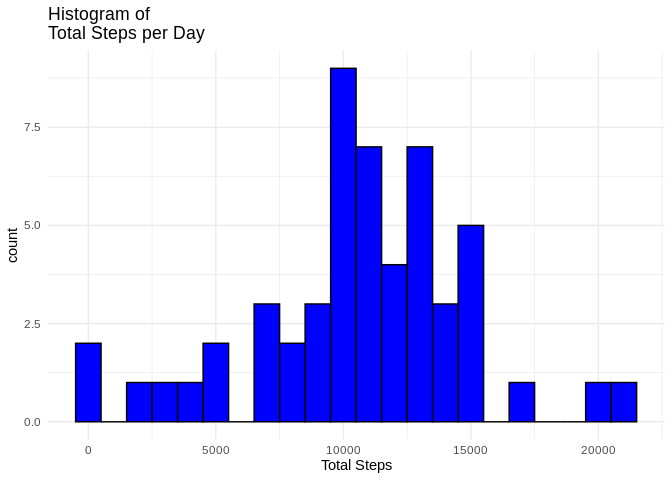
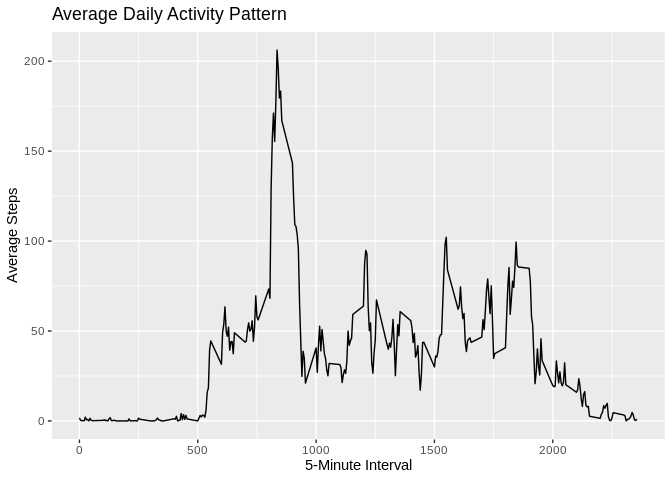
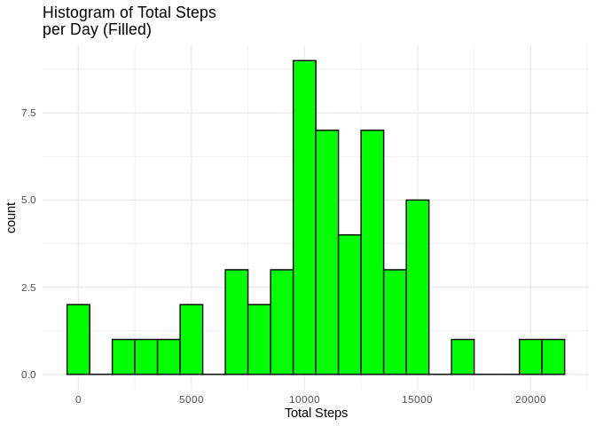
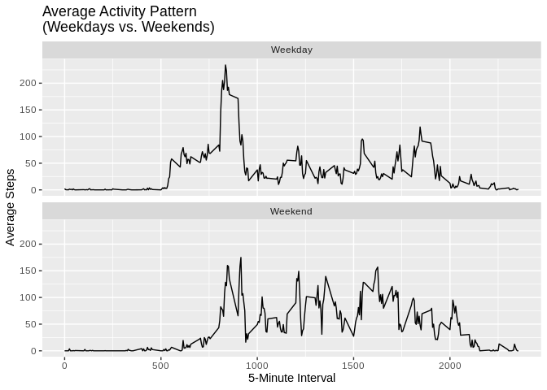

## Loading and preprocessing the data

The tidyverse is used in this project. First the dataset is unzipped
before readr's read_csv is used to read in the data.


```r
# Load necessary libraries

library(tidyverse)
```

```
## ── Attaching core tidyverse packages ──────────────────────── tidyverse 2.0.0 ──
## ✔ dplyr     1.1.2     ✔ readr     2.1.4
## ✔ forcats   1.0.0     ✔ stringr   1.5.0
## ✔ ggplot2   3.4.2     ✔ tibble    3.2.1
## ✔ lubridate 1.9.2     ✔ tidyr     1.3.0
## ✔ purrr     1.0.1     
## ── Conflicts ────────────────────────────────────────── tidyverse_conflicts() ──
## ✖ dplyr::filter() masks stats::filter()
## ✖ dplyr::lag()    masks stats::lag()
## ℹ Use the conflicted package (<http://conflicted.r-lib.org/>) to force all conflicts to become errors
```

```r
## Load the data
unzip("activity.zip")
activityDF <- read_csv("activity.csv")
```

```
## Rows: 17568 Columns: 3
## ── Column specification ────────────────────────────────────────────────────────
## Delimiter: ","
## dbl  (2): steps, interval
## date (1): date
## 
## ℹ Use `spec()` to retrieve the full column specification for this data.
## ℹ Specify the column types or set `show_col_types = FALSE` to quiet this message.
```

## Filter out missing values (NAs) in the dataset

Here the missing values are removed


```r
completeDF <- activityDF |>  filter(!is.na(steps))

## Summarize complete (without NAs) activity data

summary(completeDF)
```

```
##      steps             date               interval     
##  Min.   :  0.00   Min.   :2012-10-02   Min.   :   0.0  
##  1st Qu.:  0.00   1st Qu.:2012-10-16   1st Qu.: 588.8  
##  Median :  0.00   Median :2012-10-29   Median :1177.5  
##  Mean   : 37.38   Mean   :2012-10-30   Mean   :1177.5  
##  3rd Qu.: 12.00   3rd Qu.:2012-11-16   3rd Qu.:1766.2  
##  Max.   :806.00   Max.   :2012-11-29   Max.   :2355.0
```

## What is mean total number of steps taken per day?

This is done sequentially. At first, the steps are grouped by date.


```r
stepsByDate <- completeDF |>  group_by(date) |> 
summarise(total_steps = sum(steps))
```

Then a histogram of the grouped data is plotted.


```r
## Make a histogram of the total number of steps taken each day

stepsByDate |>  ggplot(aes(x = total_steps)) + geom_histogram(binwidth
= 1000, fill = "blue", color = "black") + labs(title = "Histogram of
Total Steps per Day", x = "Total Steps") + theme_minimal()
```

<!-- -->

## Calculate and report the mean and median total number of steps taken per day


```r
mean_steps <-mean(stepsByDate$total_steps) 
      median_steps <- median(stepsByDate$total_steps)

cat("Mean steps per day:", mean_steps, "\n") 
```

```
## Mean steps per day: 10766.19
```

```r
cat("Median steps per day:", median_steps, "\n")
```

```
## Median steps per day: 10765
```

## What is the average daily activity pattern?


```r
stepsByInterval <- completeDF |>  group_by(interval) |> 
summarise(avg_steps = mean(steps, na.rm = TRUE))
```


```r
## Make a time series plot
ggplot(stepsByInterval, aes(x = interval, y = avg_steps)) +
geom_line() + labs( title = "Average Daily Activity Pattern", x =
"5-Minute Interval", y = "Average Steps" )
```

<!-- -->


```r
## Find the 5-minute interval with the maximum average steps
max_avg_interval <- stepsByInterval |>  slice_max(order_by =
avg_steps)

cat("The 5-minute interval with the maximum average steps is:",
max_avg_interval$interval, "\n")
```

```
## The 5-minute interval with the maximum average steps is: 835
```

## Imputing missing values


```r
filledDF <- activityDF |>  left_join( stepsByDate |> 
rename(steps_new = total_steps), by = "date" ) |>  mutate(steps =
ifelse(is.na(steps), steps_new, steps)) |>  select(-steps_new)
```

## Are there differences in activity patterns between weekdays and weekends?


```r
# Make a histogram of the total number of steps taken each day

filledDF |>  group_by(date) |>  summarise(total_steps = sum(steps)) |>  ggplot(aes(x = total_steps)) + geom_histogram(binwidth = 1000, fill
= "green", color = "black") + labs( title = "Histogram of Total Steps
per Day (Filled)", x = "Total Steps" ) + theme_minimal()
```

```
## Warning: Removed 8 rows containing non-finite values (`stat_bin()`).
```

<!-- -->


```r
# Calculate and report the mean and median total number of steps #taken per day (filled data)
mean_steps_filled <-mean(stepsByDate$total_steps)

median_steps_filled <- median(stepsByDate$total_steps)

cat("Mean steps per day (filled):", mean_steps_filled, "\n")
```

```
## Mean steps per day (filled): 10766.19
```

```r
cat("Median steps per day (filled):", median_steps_filled, "\n")
```

```
## Median steps per day (filled): 10765
```


```r
# Create a new factor variable to distinguish between weekdays and weekends

filledDF <- filledDF |>  mutate( weekPart = ifelse(
weekdays(as.Date(date)) %in% c("Saturday", "Sunday"), "Weekend",
"Weekday" ) |>  as.factor() )
```


```r
# Calculate the average steps by interval for weekdays and weekends

avg_steps_by_interval_day_type <- filledDF |>  group_by(interval,
weekPart) |>  summarise(avg_steps = mean(steps, na.rm = TRUE))
```

```
## `summarise()` has grouped output by 'interval'. You can override using the
## `.groups` argument.
```


```r
# Make a panel plot
avg_steps_by_interval_day_type |>  ggplot(aes(x = interval, y =
avg_steps)) + geom_line() + labs( title = "Average Activity Pattern
(Weekdays vs. Weekends)", x = "5-Minute Interval", y = "Average Steps"
) + facet_wrap(~weekPart, ncol = 1)
```

<!-- -->
